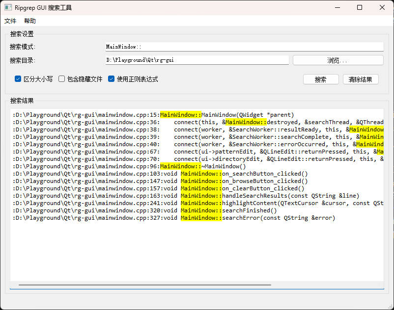

# RG-GUI

RG-GUI是一个基于Qt的图形用户界面，用于ripgrep (rg) 命令行工具。它提供了一个友好的界面，使用户能够方便地使用ripgrep的强大搜索功能，而无需记忆复杂的命令行参数。

## 功能特点

- 简洁直观的用户界面
- 支持正则表达式搜索
- 搜索结果实时显示
- 搜索结果中关键词高亮
- 多线程搜索，不阻塞主界面
- 支持自定义搜索选项

## 系统要求

- Windows操作系统
- Qt 5.15或更高版本
- ripgrep (rg.exe) 可执行文件

## 构建与运行

1. 确保您已安装Qt开发环境
2. 克隆此仓库
3. 使用Qt Creator打开`rg-gui.pro`文件
4. 构建并运行项目

## 使用方法

1. 启动应用程序
2. 选择要搜索的目录
3. 输入搜索模式（支持正则表达式）
4. 配置搜索选项（如果需要）
5. 点击"搜索"按钮开始搜索
6. 查看搜索结果

## 界面预览

## 许可证

本项目采用MIT许可证。详情请参阅[LICENSE](LICENSE)文件。 